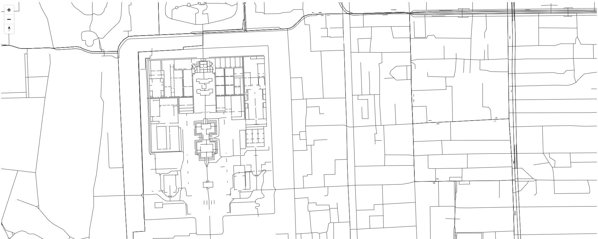

# Vector Tile Spark Process

***Vector Tile Spark Process*** 允许开发者和数据研究员使用Spark平台将地理空间数据切分到Hadoop SequeueFiles文件中.

效果来自于我们用于[预览的例子](https://github.com/codemeow5/Vector-Tile-Spark-Process/tree/master/examples).  

## 特性

- 基于Apache Spark进行并行处理
- 适配多种数据源
- 输出标准 [Mapbox Vector Tiles](https://github.com/mapbox/vector-tile-spec/tree/master/2.1 "Vector Tile Specification") 格式
- 类似于 [TileStache.Goodies.VecTiles.Provider](https://github.com/TileStache/TileStache/blob/master/TileStache/Goodies/VecTiles/server.py)的配置文件

## 依赖项

- [GeoTools](http://www.geotools.org/ "GeoTools") - 提供空间数据工具的开源Java库
- [mapbox-vector-tile-java](https://github.com/wdtinc/mapbox-vector-tile-java "mapbox-vector-tile-java") - Map Vector Tile 编解码Java库

## 要求

- Hadoop 2.7 及以上
- Spark 2.1.1 及以上
- Protocol Buffers 3.0.0-beta-2

## 开始工作

### 构建

	$ mvn clean && mvn package

### 运行

	$SPARK_HOME/bin/spark-submit --class org.ieee.codemeow.geometric.spark.VectorTileTask --master yarn --deploy-mode cluster --jars /path/to/postgresql-42.0.0.jar --driver-class-path /path/to/postgresql-42.0.0.jar /path/to/vectortile-spark-process-1.0-SNAPSHOT.jar hdfs:///path/to/vectortile-spark-process.yml

## 配置文件

	---
	# vectortile-spark-process.yml

	appName: "Vector Tile Process"
	sequenceFileDir: "hdfs:///path/to"
	layers:
	  - layerName: "layerName"
	    minZoom: "0"
	    maxZoom: "22"
	    dataProvider: "org.ieee.codemeow.geometric.spark.data.SQLDataProvider"
	    kwargs:
	      url: "jdbc:postgresql://hostname/dbname"
	      dbtables:
	        planet_osm_line: "public.planet_osm_line"
	        planet_osm_point: "public.planet_osm_point"
	        planet_osm_polygon: "public.planet_osm_polygon"
	        planet_osm_roads: "public.planet_osm_roads"
	      user: "postgres"
	      password: "postgres"
	      zooms:
	        0: "SELECT osm_id AS __id__, ST_GeomFromWKB(way) AS __geometry__ FROM ..."
	        1: "SELECT osm_id AS __id__, ST_GeomFromWKB(way) AS __geometry__ FROM ..."
			...
	        22: "SELECT osm_id AS __id__, ST_GeomFromWKB(way) AS __geometry__ FROM ..."

## 资源

- http://tilestache.org/
- https://github.com/locationtech/geomesa
- http://www.geomesa.org/documentation/current/user/spark/sparksql_functions.html
- https://github.com/mapbox/awesome-vector-tiles
- https://github.com/DataSystemsLab/GeoSpark
- https://github.com/Esri/spatial-framework-for-hadoop
- https://github.com/gbif/maps
- https://github.com/mapbox/mercantile
- https://github.com/modestmaps/modestmaps-processing
- http://www.maptiler.org/google-maps-coordinates-tile-bounds-projection/

## 问题

如果你找到一些问题或者希望我们提供一些新特性，请通过提交Issue的方式通知我们.

## 贴士

1. 升级你的Spark集群的protobuf版本  

	>cp protobuf-java-3.0.0-beta-2.jar $SPARK_HOME/jars  

2. 在配置文件的***zooms***节，请使用SparkSQL
